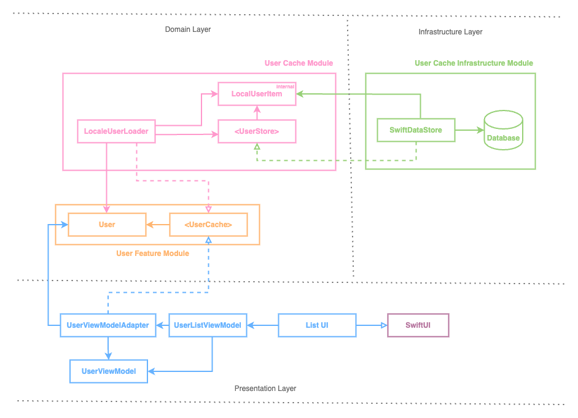

[](https://github.com/mushthak/TDDSwiftDataMVVM/actions/workflows/CI-macOS.yml)
[](https://github.com/mushthak/TDDSwiftDataMVVM/actions/workflows/CI-iOS.yml)

# TDDSwiftDataMVVM

## Application Overview

TDDSwiftDataMVVM is an iOS application that demonstrates the use of Test-Driven Development (TDD) with the Model-View-ViewModel (MVVM) architecture pattern. The application is built using Swift and leverages SwiftUI for the user interface. It showcases best practices for building maintainable and testable iOS applications.

### Features

- **MVVM Architecture**: Separation of concerns by dividing the application into Model, View, and ViewModel layers.
- **Test-Driven Development**: Writing tests before implementing the actual functionality to ensure code quality and reliability.
- **SwiftUI**: Modern declarative framework for building user interfaces across all Apple platforms.
- **Swift Data**: Persistent storage for managing the application's data model.
- **Unit Testing**: Comprehensive unit tests to validate the functionality of the ViewModels and Models.


### License

This project is licensed under the MIT License. See the [LICENSE](LICENSE) file for more details.

# User Stories:

## 1. Customer requests to see user list

### Narrative #1:

```
As customer
I want the app to show the latest saved user list
So I can view the whole list of users I have 
```

#### Acceptance criterias:
```
Given there’s a cached version of the users
 When the customer requests to see the users
 Then the app should display the saved user list
 ```

  ```
Given the cache is empty
 When the customer requests to see the users
 Then the app should show empty list
 ```

## 2. Customer requests to add new user

### Narrative #1:

```
As customer
I want the app to allow saving new user detail
So I can view them later
```

#### Acceptance criterias:
```
Given there’s a no cached version of the users
 When the customer adds a new user
 Then the app should display the latest user saved in the list
 ```

```
Given there’s a cached version of the users
 When the customer adds a new user
 Then the app should display whole users including the last added one
 ```


## 3. Customer requests to delete a user

### Narrative #1:

```
As customer
I want the app to allow deleting an existing user
So I can remove them from the list
```

#### Acceptance criterias:

```
Given there’s more than one cached version of the users
 When the customer deletes a user
 Then the app should list the remaining users
 ```

```
Given there’s more than one cached version of the users
 When the customer deletes a user
 Then the app should show empty list
 ```
---
# Use cases

### Load Users From Cache Use Case

#### Primary course:
```
1. Execute "Load users" command.
2. System retrieves user data from cache.
4. System creates user list from cached data.
5. System delivers user list.
```

#### Retrieval error course (sad path):
```
1. System delivers error.
```

#### Empty cache course (sad path):
``` 
1. System delivers empty users.
```

---

### Cache Users Use Case

#### Data:
```
User
```

#### Primary course (happy path):
```
1. Execute "Save user" command with above data.
3. System encodes users.
4. System saves new cache data.
5. System delivers success message.
```

#### Saving error course (sad path):
```
1. System delivers error.
```

---

### Delete User Use Case

#### Data:
```
User
```

#### Primary course (happy path):
```
1. Execute "Remove user" command with above data.
2. Systen deletes the user data from the cache
3. System delivers success message.
```

#### Deleting error course (sad path):
```
1. System delivers error.
```
---
## Architecture


